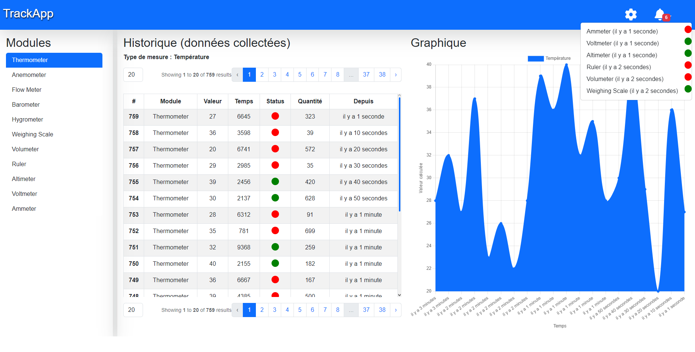
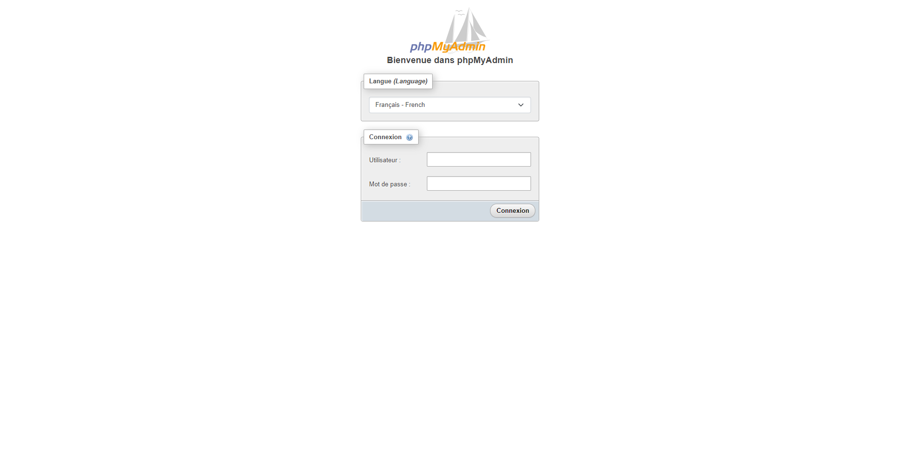
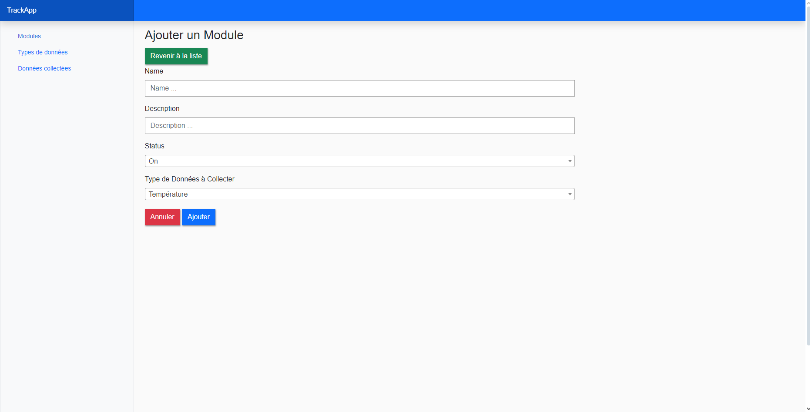
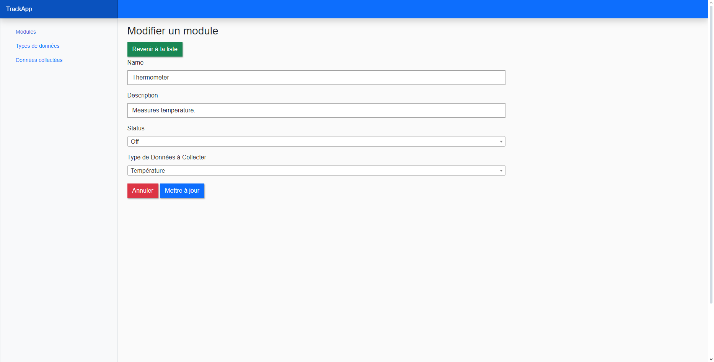
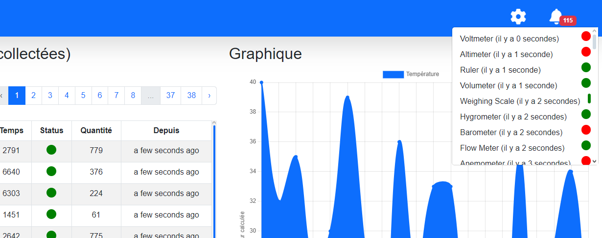

# TrackApp - Application de Monitoring des Performances des Modules IoT

TrackApp est une application web développée avec le framework Laravel, conçue pour collecter en temps réel les performances des modules IoT connectés. Cette application permet de surveiller l'état de fonctionnement des modules, de visualiser les données collectées sous forme de graphiques et de recevoir des notifications en cas de dysfonctionnement.

Pour partager votre projet et fournir des instructions claires pour le déploiement dans un conteneur Docker, voici une documentation complète :

## Comment Lancer l'Application ?

### Étape 1 : Vérifier l'Installation de Docker

Assurez-vous que Docker et Docker Compose sont installés sur la machine cible. Utilisez les commandes suivantes pour vérifier :

#### Vérifier Docker

```bash
docker --version
```

Vous devriez voir une sortie indiquant la version de Docker installée, par exemple :

```bash
Docker version 20.10.7, build f0df350
```

#### Vérifier Docker Compose

```bash
docker-compose --version
```

Vous devriez voir une sortie indiquant la version de Docker Compose installée, par exemple :

```bash
docker-compose version 1.29.2, build 5becea4c
```

Si Docker ou Docker Compose ne sont pas installés, suivez les instructions d'installation sur le site officiel de Docker :
- **Docker** : [Installation Docker](https://docs.docker.com/get-docker/)
- **Docker Compose** : [Installation Docker Compose](https://docs.docker.com/compose/install/)

### Étape 2 : Décompresser le Projet

Décompressez le projet que vous avez partagé. Si le projet est sous forme d'archive (par exemple, `project.zip`), utilisez la commande suivante pour le décompresser :

```bash
unzip project.zip -d project-directory
```

ou, si l'archive est au format tar.gz :

```bash
tar -xvzf project.tar.gz -C project-directory
```

### Étape 3 : Lancer l'Application

1. **Naviguer vers le Répertoire du Projet** :

   Accédez au répertoire racine du projet décompressé :

   ```bash
   cd project-directory
   ```

2. **Démarrer les Conteneurs Docker** :

   Exécutez la commande suivante pour construire et démarrer les conteneurs Docker définis dans le fichier `docker-compose.yml` :

   ```bash
   docker-compose up
   ```

   Cette commande :
   - Construit les images Docker à partir du Dockerfile.
   - Démarre les conteneurs définis dans le fichier `docker-compose.yml`.
   - Expose les ports définis pour accéder aux services.

### Structure du Projet

Assurez-vous que votre projet contient les fichiers suivants à la racine :

1. **Dockerfile**
2. **docker-compose.yml**
3. **start.sh**
4. **cron.js**
5. **package.json**

### Vérification

1. **Consulter les Logs** : Pour vérifier que tout fonctionne correctement, vous pouvez consulter les logs du conteneur en utilisant :

   ```bash
   docker logs -f cron-job-container
   ```

2. **Accéder à Apache** : Ouvrez votre navigateur et accédez à `http://localhost` pour vérifier que le serveur Apache fonctionne. Vous devriez avoir une page comme ceci :


3. **Accéder à phpmyadmin** : Ouvrez votre navigateur et accédez à `http://localhost:8080` pour vérifier l'interface de gestion de la base de données. Vous devriez avoir une page comme ceci :

Les identifiants de connexion sont dan le fichier .env à la racine de du projet.

4. **Vérifier le Script Cron** : Les messages de log devraient indiquer que le script cron s'exécute à intervalles réguliers.

En suivant ces étapes, vous devriez être en mesure de lancer et vérifier le bon fonctionnement de votre application en utilisant Docker et Docker Compose.


## Rapport de Réalisation

### Création de la Base de Données
Une base de données a été créée pour répertorier les modules IoT, leurs détails et l'historique de fonctionnement. Les tables nécessaires ont été conçues pour stocker les informations pertinentes, telles que les modules, les types de mesure et les données collectées.

### Formulaire d'Inscription des Modules

Un formulaire a été mis en place pour permettre l'inscription de nouveaux modules dans l'application. Ce formulaire recueille les informations nécessaires sur les modules, telles que leur nom, leur emplacement, etc., et les enregistre dans la base de données.

- Route pour ajouter un module : `/admin/modules/create`


- Route pour modifier un module( exemple : module d'identifiant 2) : `/admin/admin/modules/edit/2`


### Page de Visualisation de l'État de Fonctionnement des Modules

Une page de visualisation a été développée pour afficher l'état de fonctionnement des modules. Cette page présente des informations telles que la valeur mesurée actuelle, la durée de fonctionnement, le nombre de données envoyées et l'état de marche. De plus, un graphique interactif permet de suivre l'évolution de la valeur mesurée au fil du temps.


### Notifications Visuelles en Cas de Dysfonctionnement

Des notifications visuelles ont été intégrées à l'interface pour alerter les utilisateurs en cas de dysfonctionnement d'un module. Ces notifications sont conçues pour attirer l'attention de l'utilisateur et lui permettre de réagir rapidement aux problèmes détectés.

- Route  : `/`


### Script de Génération Automatique d'État des Modules

Un script côté serveur a été développé pour générer automatiquement l'état des modules. Ce script surveille en permanence l'état des modules et déclenche des notifications en cas de dysfonctionnement. Il assure ainsi une surveillance continue et proactive de l'état des modules.

### Génération de Données Numériques et Stockage dans la Base de Données

Les modules ont été configurés pour générer des données numériques sur les mesures qu'ils effectuent, telles que la température, la vitesse, etc. Ces données sont ensuite stockées dans la base de données, permettant ainsi de conserver un historique des mesures réalisées. De plus, les modules peuvent tomber en panne et refonctionner de manière aléatoire, assurant ainsi une simulation réaliste de leur fonctionnement dans des conditions variées. La génération de l'historique des données se poursuit de manière transparente même lors de la navigation sur l'interface web de l'application de test.


## Routes

### Public Routes

- **GET /** : Affiche la page d'accueil de l'application.
- **GET /module/{slug}** : Affiche les détails d'un module spécifique selon son slug.
- **GET /api/module** : Récupère les données des modules via une API.
- **GET /api/module/{slug}** : Récupère les données d'un module spécifique via une API.

### Routes d'Administration

#### Modules

- **GET /admin/modules** : Affiche la liste des modules enregistrés.
- **GET /admin/modules/show/{id}** : Affiche les détails d'un module spécifique.
- **GET /admin/modules/create** : Affiche le formulaire de création d'un nouveau module.
- **GET /admin/modules/edit/{id}** : Affiche le formulaire d'édition d'un module spécifique.
- **POST /admin/modules/store** : Enregistre un nouveau module.
- **PUT /admin/modules/update/{module}** : Met à jour les informations d'un module.
- **PUT /admin/modules/speed/{module}** : Met à jour rapidement les informations d'un module.
- **DELETE /admin/modules/delete/{module}** : Supprime un module.

#### Types de Mesure

- **GET /admin/measured_types** : Affiche la liste des types de mesure enregistrés.
- **GET /admin/measured_types/show/{id}** : Affiche les détails d'un type de mesure spécifique.
- **GET /admin/measured_types/create** : Affiche le formulaire de création d'un nouveau type de mesure.
- **GET /admin/measured_types/edit/{id}** : Affiche le formulaire d'édition d'un type de mesure spécifique.
- **POST /admin/measured_types/store** : Enregistre un nouveau type de mesure.
- **PUT /admin/measured_types/update/{measured_type}** : Met à jour les informations d'un type de mesure.
- **PUT /admin/measured_types/speed/{measured_type}** : Met à jour rapidement les informations d'un type de mesure.
- **DELETE /admin/measured_types/delete/{measured_type}** : Supprime un type de mesure.

#### Données Collectées

- **GET /admin/data_collecteds** : Affiche la liste des données collectées.
- **GET /admin/data_collecteds/show/{id}** : Affiche les détails d'une donnée collectée spécifique.
- **GET /admin/data_collecteds/create** : Affiche le formulaire de création d'une nouvelle donnée collectée.
- **GET /admin/data_collecteds/edit/{id}** : Affiche le formulaire d'édition d'une donnée collectée spécifique.
- **POST /admin/data_collecteds/store** : Enregistre une nouvelle donnée collectée.
- **PUT /admin/data_collecteds/update/{data_collecteds}** : Met à jour les informations d'une donnée collectée.
- **PUT /admin/data_collecteds/speed/{data_collecteds}** : Met à jour rapidement les informations d'une donnée collectée.
- **DELETE /admin/data_collecteds/delete/{data_collecteds}** : Supprime une donnée collectée.

Ces routes sont essentielles pour naviguer dans l'application et interagir avec les modules IoT simulés.
